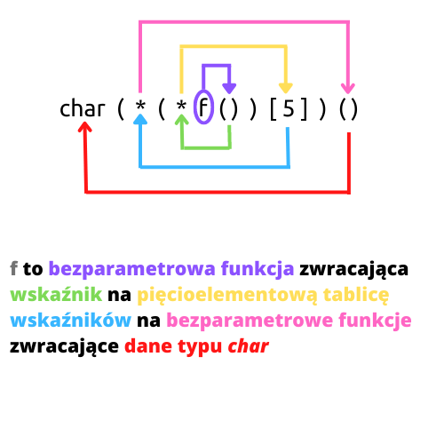

# Podstawy wskaźników, tablic i dynamicznej alokacji pamięci C++ (ściągawka)

**Przydatne linki**

- [Pasja informatyki - Kurs C++ odc. 10: Wskaźniki. Dynamiczne alokowanie pamięci](https://www.youtube.com/watch?v=0DQl74alJzw)
- [malloc(3) — Linux manual page](https://man7.org/linux/man-pages/man3/free.3.html)
- [Cprogramming - Function Pointers in C and C++](https://www.cprogramming.com/tutorial/function-pointers.html)
- [BegginersBook - Two dimensional (2D) arrays in C programming with example](https://beginnersbook.com/2014/01/2d-arrays-in-c-example/)
- [Programiz - C Pointers](https://www.programiz.com/c-programming/c-pointers)
- [Programiz - C++ Pointers](https://www.programiz.com/cpp-programming/pointers)
- [Programiz - C Multidimensional Arrays](https://www.programiz.com/c-programming/c-multi-dimensional-arrays)
- [Programiz - C Dynamic Memory Allocation](https://www.programiz.com/c-programming/c-dynamic-memory-allocation)
- [cdecl - C gibberish ↔ English](https://cdecl.org/)
- [RIP Tutorial - Using the right-left or spiral rule to decipher C declaration](https://riptutorial.com/c/example/18833/using-the-right-left-or-spiral-rule-to-decipher-c-declaration)
- [Learn To Code Together - char *, const char *, const * char, and const char * const in C](https://learntocodetogether.com/char-const-vs-char-const-char-vs-const-char-const-in-c/)
- [bulldogjob.pl - Jak zrozumieć pamięć programu?](https://bulldogjob.pl/readme/jak-zrozumiec-pamiec-programu)

**Spis treści**
- [Podstawy wskaźników, tablic i dynamicznej alokacji pamięci C++ (ściągawka)](#podstawy-wskaźników-tablic-i-dynamicznej-alokacji-pamięci-c-ściągawka)
  - [Czym jest *wskaźnik*?](#czym-jest-wskaźnik)
  - [Tablice](#tablice)
  - [Dynamiczny przydział pamięci](#dynamiczny-przydział-pamięci)
    - [W języku C++ (`new`)](#w-języku-c-new)
    - [W języku C (`malloc`)](#w-języku-c-malloc)
  - [Wskaźniki na funkcje](#wskaźniki-na-funkcje)
  - [(statyczne) Tablice *dwuwymiarowe*](#statyczne-tablice-dwuwymiarowe)
  - [Takie wskaźniki co może nie miał\_ś pojęcia, że można zrobić](#takie-wskaźniki-co-może-nie-miał_ś-pojęcia-że-można-zrobić)
  - [Zasada spirali](#zasada-spirali)
  - [Wskaźniki a słowo kluczowe `const`](#wskaźniki-a-słowo-kluczowe-const)
  - [Ciekawostka na temat pamięci](#ciekawostka-na-temat-pamięci)

## Czym jest *wskaźnik*?

*Wskaźnik* to specyficzny rodzaj zmiennej, która przechowuje adres pamięci (danych danego typu). Może wskazywać na przykład na adres innej zmiennej lub na adres pamięci przydzielonej dynamicznie.

Rozmiar wskaźnika:
- na architekturze 64-bitowej - 8 bajtów (64 bity)
- na architekturze 32-bitowej - 4 bajty (32 bity)

```cpp
#include <iostream>

using namespace std;

int main()
{
    int n = 10;

    int *p; // wskaźnik na typ int 

    p = &n; // przypisanie adresu pamięci do wskaźnika

    cout << "Adres n: " << &n << endl;
    cout << "Adres p: " << &p << endl;
    cout << "p wskazuje na adres: " << p << endl;

    // wypisanie wartości zmiennej n
    cout << n << endl;

    // wypisanie zawartości pamięci,
    // na którą wskazuje wskaźnik
    cout << *p << endl;

    // obserwacja zmiany wartości n i *p
    n = 20;

    cout << n << endl;

    cout << *p << endl;

    return 0;
}
```

## Tablice

Nazwa tablicy jest jednocześnie ***wskaźnikiem*** na pierwszy element tej tablicy, co oznacza, że można *dobierać się* do jej elementów poprzez operator "`*`":

```cpp
#include <iostream>

using std::cout;
using std::endl;

// do funkcji przekazujemy wskaźnik
void arr_test1(int *arr, int n)
{
    for(int i = 0; i < n; ++i)
        *(arr + i) *= 2;
}

int main()
{
    int arr[5] = {1, 2, 3, 4, 5};
     cout << *arr << endl;
     arr_test1(arr, 5);  // nazwa tablicy jest wskaźnikiem
     for(int i = 0; i < 5; ++i)
        cout << arr[i] << ' ';
     cout << endl;
}
```

## Dynamiczny przydział pamięci

Program może *poprosić* system o zarezerwowanie dla niego pewnej ilości pamięci. Jest to tak zwana *alokacja* pamięci. 

Po zakończeniu korzystania z dynamicznie przydzielonej pamięci, należy ją *zwolnić* (*dealokacja*). Jeśli pamięć nie zostanie zwolniona, dochodzi do tak zwanego [*wycieku pamięci* (*memory leak*)](https://en.wikipedia.org/wiki/Memory_leak).

Dane korzystające z dynamicznie przydzielonej pamięci korzystają z obszaru zwanego [*stertą*](https://pl.wikipedia.org/wiki/Sterta_(informatyka)).

### W języku C++ (`new`)

```cpp
#include <iostream>

using namespace std;

int main()
{
    // proste typy

    // dynamiczny przydział pamięci
    int *n = new int;

    *n = 10;

    cout << "Adres pamięci: " << n << endl;
    cout << "Wartość: " << *n << endl;

    // zwolnienie pamięci
    delete n;

    // tablice

    // alokowanie pamięci dla tablicy;
    // nazwa tablicy jest wskaźnikiem na jej
    // pierwszy element
    int *a = new int [5]{1, 2, 3, 4, 5};

    // szybsze przejście przez elementy tablicy
    for (int i = 0; i < 5; ++i)
    {
        // pobieramy dane z adresu w pamięci
        // a + i (tablice mają dane ustawione "obok siebie")
        // zapis a[i] jest również poprawny
        cout << *(a + i) << endl;
    }

    // inaczej
    int *p = a;
    for (int i = 0; i < 5; ++i)
    {
        // wypisanie zawartości i-tej
        // komórki tablicy
        cout << *p << endl;

        // inkrementacja wskaźnika,
        // aby wskazywał kolejny element
        p++;
    }

    // usunięcie tablicy
    delete [] a;

    // struktury

    struct struktura
    {
        int wiek;
        int wzrost;
    };

    // dynamiczne utworzenie struktury
    struktura *s = new struktura{17, 182};

    // dostęp do pól struktury w przypadku wskaźnika
    // uzyskujemy za pomocą "->" (a nie ".")
    cout << "Wiek: " << s->wiek << endl;
    cout << "Wzrost: " << s->wzrost << endl;

    // usunięcie struktury
    delete s;

    return 0;
}
```

### W języku C (`malloc`)

```cpp
#include <stdio.h>
#include <stdlib.h>

// dla użytkowników linuxa (i ewentualnie macOS):
// polecenie: 
// man 3 malloc

int main()
{
    // proste typy

    // alokacja pamięci
    // alokujemy odpowiednią ilość bajtów
    // dla typu int
    int *n = malloc(sizeof(int));

    *n = 10;

    printf("Adres: 0x%0x, dane: %d\n", n, *n);

    // zwolnienie pamięci
    free(n);

    // tablice

    // alokacja pamięci dla tablicy
    int *a = malloc(5 * sizeof(int));

    // zapełnienie tablicy
    int i;
    for (i = 0; i < 5; ++i)
    {
        a[i] = i + 1;
    }

    // wypisanie zawartości tablicy
    for (i = 0; i < 5; ++i)
    {
        printf("%d\n", *(a + i));
    }

    free(a);

    // struktury

    struct struktura
    {
        int wiek;
        int wzrost;
    };

    struct struktura *s = malloc(sizeof(struct struktura));

    s->wiek = 19;
    s->wzrost = 188;

    printf("Wiek: %d, wzrost: %d\n", s->wiek, s->wzrost);

    free(s);
}
```

>**Uwaga**: w języku C istnieje również funkcja `realloc`, która pozwala na zmianę wielkości tablicy dynamicznej

## Wskaźniki na funkcje

Można tworzyć nie tylko wskaźniki, które wskazują na dane, ale również takie, które wskazują na funkcje. Dzięki temu można przykładowo przekazać funkcję jako argument innej funkcji.

```cpp
#include <stdio.h>

void PrintInt(int n)
{
    printf("%d\n", n);
}

// przekazanie wskaźnika do funkcji
// jako parametru
void DoStuff(int n, void (*func)(int))
{
    func(n);
}

int main()
{
    // deklaracja wskaźnika na funkcję
    // o podanej sygnaturze
    void (*funcp)(int);

    // przypisanie funkcji do wskaźnika
    funcp = &PrintInt;

    // wywołanie funkcji
    funcp(10);

    // przekazanie funkcji jako argument
    // dla innej funkcji
    DoStuff(15, PrintInt);

    return 0;
}
```

## (statyczne) Tablice *dwuwymiarowe*

*Tablica dwuwymiarowa* to uproszczone stwierdzenie i należy tego pojęcia używać ostrożnie.

```cpp
int Tab[N][M];  // "tablica dwuwymiarowa"
```

Tak naprawdę możemy to rozumieć jako tablicę, która zawiera *N* innych tablic, z których każda zawiera *M* elementów. Uzyskujemy wtedy efekt tablicy dwuwymiarowej lub macierzy.

Do elementów tablicy dwuwymiarowej uzyskujemy dostęp poprzez dwa indeksy:

```cpp
// Bierzemy j-ty element z i-tej tablicy
// w tablicy tablic (tablicy dwuwymiarowej)
cout << Tab[i][j] << endl;
```

Mając w pamięci fakt, że nazwa tablicy jest również wskaźnikiem na jej pierwszy element i wiedząc, że pracujemy z *tablicą tablic*, możemy odwoływać się do jej elementów w ten sposób:

```cpp
cout << *(*(Tab + i) + j) << endl;  // to samo co Tab[i][j]
```

## Takie wskaźniki co może nie miał_ś pojęcia, że można zrobić

W językach C i C++ można deklarować przeróżne dane, wskaźniki, tablice i funkcje.

Poniżej kilka przykładów wraz z opisem słownym:

```cpp
int n;      // zmienna przechowująca liczbę typu int
int *w;     // wskaźnik na liczbę typu int

w = &n;     // przypisanie adresu zmiennej n do w

int t[];    // tablica liczb typu int

int f();    // bezparametrowa funkcja zwracająca liczbę typu int

int **p;    // wskaźnik [wskazujący] na wskaźnik na int

int (*wt)[5];    // wskaźnik na tablicę liczb typu int

int tab[5];
wt = &tab;      // przypisanie adresu tablicy do wskaźnika

int (*wf)();    // wskaźnik na funkcję zwracającą int

int *fw();      // funkcja zwracająca wskaźnik na int

int ***www;     // wskaźnik na wskaźnik na wskaźnik na liczbę typu int

int (**wwt)[];  // wskaźnik na wskaźnik na tablicę liczb typu int

int *(*wtw)[];  // wskaźnik na tablicę wskaźników na int

int *(*fwt())[];    // funkcja zwracająca wskaźnik na tablicę wskaźników na int

// i czego tylko dusza zapragnie...
```

Łatwo się zgubić w tym, *czym* dana zmienna jest. Należy więc odpowiedzieć na pytanie: *jak to ***** czytać?*

## Zasada spirali

*Odszyfrowywanie* zmiennych należy zaczynać od nazwy i poruszać się *w prawo*, zgodnie z ruchem wskazówek zegara.

```cpp
// np.
char (*(*f())[5])();

/*

To coś powyżej to funkcja zwracająca wskaźnik na pięcioelementową tablicę wskaźników na bezparametrowe funkcje zwracające dane typu char.

Oczywiste prawda?

*/
```



## Wskaźniki a słowo kluczowe `const`

W zależności od tego gdzie dodamy słowo kluczowe `const`, różne dane będą *stałe*

zmienna | opis
:--- | :---
`char *s` | zarówno wartość samego wskaźnika (adresu, na który wskazuje), jak i to na co wskazuje jest modyfikowalne
`const char* s` | wartość samego wskaźnika można zmieniać, ale **nie można** zmienić zawartości tego, na co wskazuje
`char * const s` | **nie można** modyfikować wartości wskaźnika, ale można modyfikować dane, na które wskazuje
`const char * const s` | **nie można** modyfikować zarówno wartości wskaźnika ani danych, na które wskazuje

## Ciekawostka na temat pamięci

Zmienne lokalne, które nie są zmiennymi dynamicznymi, trzymane są w obszarze pamięci zwanym [*stosem*](https://en.wikipedia.org/wiki/Stack-based_memory_allocation). Ulokowane są po kolei *obok siebie* (a przynajmniej powinny być), z tym że stos *rośnie w dół*, czyli wcześniej zadeklarowane zmienne będą mieć wyższe adresy w pamięci

```cpp
#include <iostream>

using namespace std;

int main()
{
    int a = 1, b = 2, c = 3, d = 4;
    
    // modyfikacja wartości zmiennej a
    // poprzez adres zmiennej c
    *(&c + 2) = 5;

    cout << "a: " << a  << " " << &a << endl;
    cout << "b: " << b << " " << &b  << endl;
    cout << "c: " << c << " " << &c << endl;
    cout << "d: " << d << " " << &d  << endl;

    cout << "&c + 2 = " << &c + 2 << endl;
    cout << "&c + 1 = " << &c + 1 << endl;
}
```

Mając te informacje można pomyśleć na przykład jak uporządkować rosnąco cztery liczby całkowite (bez użycia tablicy):

```cpp
#include <iostream>

using namespace std;

int main()
{
    int a, b, c, d;
    cin >> a >> b >> c >> d;

    // sortowanie bąbelkowe
    for (int i = 0; i < 4; ++i)
    {
        for (int j = 1; j < 4; j++)
        {
            if(*(&d + j - 1) < *(&d + j))
            {
                int temp = *(&d + j - 1);
                *(&d + j - 1) = *(&d + j);
                *(&d + j) = temp;
            }
        }
    }

    cout << a << endl;
    cout << b << endl;
    cout << c << endl;
    cout << d << endl;
    return 0;
}
```
